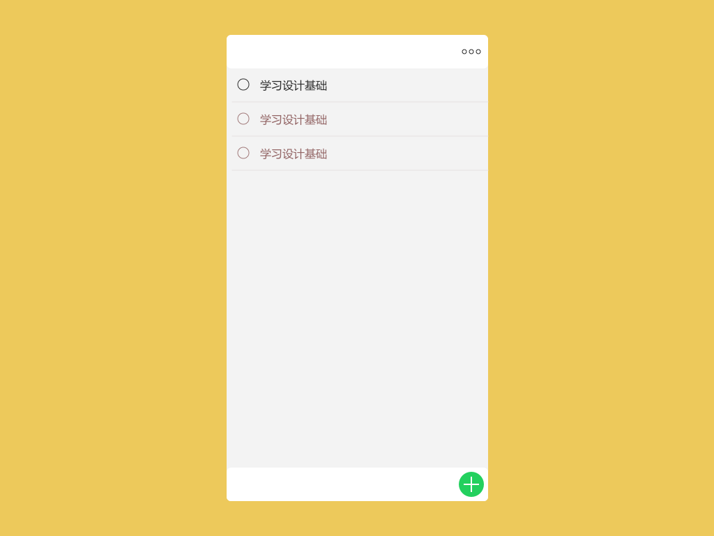
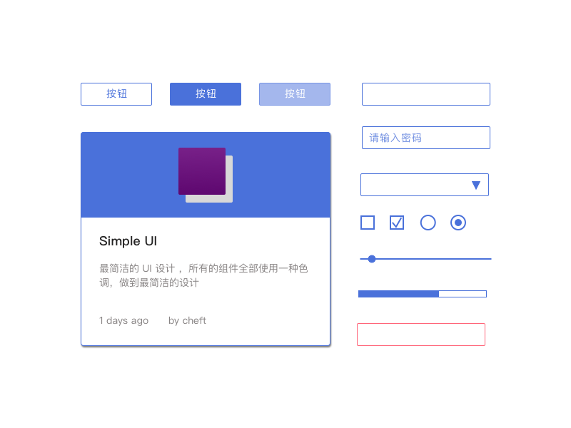
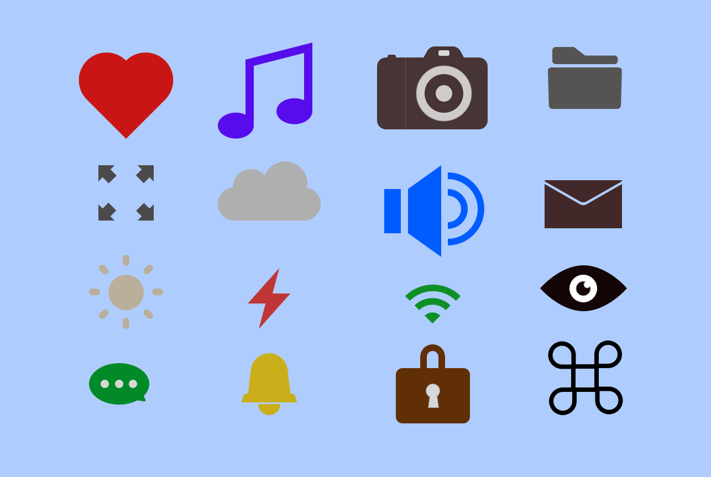
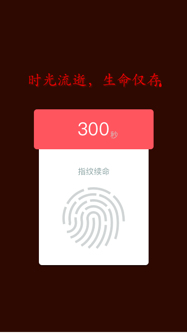
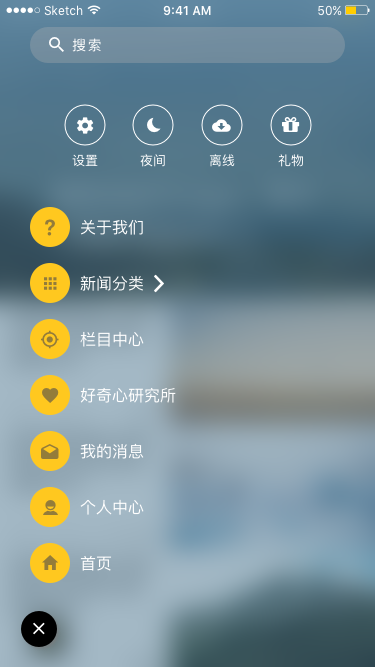

# 30DaysofDesign

A programmer and wife learning design

## Designs

1. Todos
1. LoginForm
1. SimpleUI
1. Makeicons
1. Life
1. Daily
1. GoodNews
1. ...

## Tutorials
* [best](https://designcode.io/)
* [sketch-3-design-tutorials](https://webdesignledger.com/sketch-3-design-tutorials/)
* [makeicons](http://weibo.com/p/10080884be2c4828ddfb0b13124ffc6c830175?k=makeicons&from=501&_from_=huati_topic#_rnd1473754586900)

## Sketch Plugins
* Craft
* Icon Font
* Slicer
* App Assets Export

## Images
### Todos

### LoginForm

### SimpleUI

### Makeicons

### Life

### Daily

### GoodNews

## License

30 Days of Design is under the MIT license.
